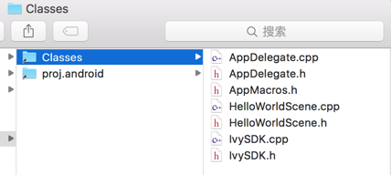
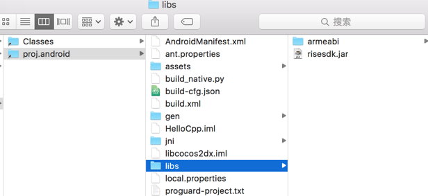

# RiseSDK for cocos2d-x
## Version: 3.2

## 1, Copy files and init in Activity

* copy Classes and proj.android to your Cocos2d-x project folder corresponding
* before:
<center></center>
* after:
<center></center>
<center></center>

* init in your main activity
```java
    @Override
    protected void onCreate(Bundle savedInstanceState) {
        super.onCreate(savedInstanceState);
        Cocos.onCreate(this);
    }

    @Override
    protected void onResume() {
        super.onResume();
        Cocos.onResume(this);
    }

    @Override
    protected void onPause() {
        super.onPause();
        Cocos.onPause();
    }

    @Override
    protected void onDestroy() {
        Cocos.onDestroy();
        super.onDestroy();
    }

    @Override
    protected void onActivityResult(int requestCode, int resultCode, Intent data) {
        Cocos.onActivityResult(requestCode, resultCode, data);
        super.onActivityResult(requestCode, resultCode, data);
    }
```

* if you use proguard to obfuscate your java source code, you should add these rules to your proguard rules file:
```java
-dontwarn com.unity3d.**
-keep class com.android.client.** {
    <methods>;
}

-keep class android.support.** {
    *;
}

-keep class com.core.async.** {
    public *;
}

-keep class com.core.common.** {
    public *;
}

-keep class com.core.network.** {
    public *;
}

-keep class com.core.view.** {
    public *;
}

```

## 2, add IvySDK.cpp to your Android.mk file


##3，页面广告API

*全屏广告，需配置不同时机弹出的广告，以便于后台统计,我们预定义了以下几种时机弹出的广告：
```cpp
IvySDK::showFullAd(IvySDK::AD_POS_GAME_START); //游戏开始时
IvySDK::showFullAd(IvySDK::AD_POS_GAME_PAUSE); //游戏暂停
IvySDK::showFullAd(IvySDK::AD_POS_GAME_PASSLEVEL);//游戏过关
IvySDK::onQuit();//游戏退出并调用广告
IvySDK::showFullAd(IvySDK::AD_POS_GAME_CUSTOM); //您还使用自定义类型广告
```
注意：以上类型广告的弹出不要在activity的生命周期onResume()和onPause()中调用

*banner广告
```cpp
 static const int AD_POS_LEFT_TOP = 1;//左上角显示banner广告
 static const int AD_POS_MIDDLE_TOP = 3;//中间上部显示banner广告
 static const int AD_POS_RIGHT_TOP = 6;//右上角显示banner广告
 static const int AD_POS_MIDDLE_MIDDLE = 5;//中间显示banner广告
 static const int AD_POS_LEFT_BOTTOM = 2;//左下角显示banner广告
 static const int AD_POS_MIDDLE_BOTTOM = 4;//中间底部显示banner广告
 static const int AD_POS_RIGHT_BOTTOM = 7;//右下角显示banner广告
	
 IvySDK.showBanner("default", IvySDK::AD_POS_MIDDLE_BOTTOM); //居中显示banner广告
 IvySDK.closeBanner(); //关闭banner广告
 ```
##4, fackbook API和回调
如果你想使用fackbook相关功能，你应该按如下去做:
* 定义sms回调函数并注册
```cpp
void onReceiveSNSResult(int resultType, bool success, int extra) {
    switch(resultType) {
        case IvySDK::SNS_RESULT_LOGIN:
            if (success) {
                // now do your login logic, get profile, friends etc.
                const char* mestring = IvySDK::me();
                CCLOG("me string is %s", mestring);
            }
            break;

        case IvySDK::SNS_RESULT_LIKE:
            if (success) {
                CCLOG("thank you for like us.");
            }
            break;

        case IvySDK::SNS_RESULT_INVITE:
            if (success) {
                CCLOG("thank you invite your friends. you will receive 10 golds.");
            }
            break;

        case IvySDK::SNS_RESULT_CHALLENGE:
            if (extra > 3) {
                CCLOG("thank you challenge 3 friends, you will receive 10 golds.");
            }
            break;
    }
}

// 在初始化的时候注册你的回调函数
bool HelloWorld::init() {
  ...
  IvySDK::registerSNSCallback(onReceiveSNSResult);
  ...
}
```
* 注意:
SNS_RESULT* 定义在 namespace IvySDK,你不需要重新定义
```cpp
static const int SNS_RESULT_LOGIN = 1;
static const int SNS_RESULT_INVITE = 2;
static const int SNS_RESULT_CHALLENGE = 3;
static const int SNS_RESULT_LIKE = 4;
```

* 现在你可以使用如下fackbook相关接口:
```cpp
// fackbook登录
IvySDK::login();

//fackbook登出
IvySDK::logout();

//fackbook是否已经在登录状态
IvySDK::isLogin();

//fackbook点赞
IvySDK::like();

// fackbook邀请
IvySDK::invite();

// 挑战其他facebook好友
IvySDK::challenge("challenge you", "speed coming....");

// 获得玩家fackbook数据，返回json字符串 {"id":"xxx", "name":"xxx", "picture":"/sdcard/.cache/xxxx"}
const char* profileString = IvySDK::me();

// 获得玩家好友的facebook数据，返回json字符串数组: [{"id":"xxx", "name":"xxx", "picture":"/sdcard/.cache/xxxx"}, ...]
const char* friendString = IvySDK::friends();
```

## 5, 内付API和回调
当使用这个接口的时候，你应该按照如下去做：
* 注册你的支付回调函数
```c++
// 定义你的计费id
#define BILLING_ID_ACTIVE_GAME 1
#define BILLING_ID_BUY_CAR 2

//处理支付成功后的相应动作
static void onPaymentSuccess(int billId) {
	switch (billId) {
	case BILLING_ID_ACTIVE_GAME:
		CCLOG("game actived!");
    // do your logic here
		break;

    case BILLING_ID_BUY_CAR:
    // do your logic here
        break;
	}
}

//定义回调函数，这个函数应该是一个全局函数或者是类成员函数
void HelloWorld::onPaymentResult(int resultCode, int billingId) {
    CCLOG("billing %i result code %i", billingId, resultCode);
	switch (resultCode) {
	case IvySDK::PAYMENT_RESULT_SUCCESS:
		onPaymentSuccess(billingId);
		break;

	default:
		CCLOG("billing %i result code %i", billingId, resultCode);
		break;
	}
}

// 在初始化的时候注册你的回调函数
bool HelloWorld::init() {
  ...
  IvySDK::registerPaymentCallback(onPaymentResult);
  ...
}
```
* 注意
PAYMENT_RESULT* 已经被定义在 namespace IvySDK,你不需要重新定义
```cpp
static const int PAYMENT_RESULT_SUCCESS = 0;
static const int PAYMENT_RESULT_CANCEL = 1;
static const int PAYMENT_RESULT_FAILURE = 2;
```

* 调用计费接口
```c++
IvySDK::pay(BILLING_ID_ACTIVE_GAME);
```

## 6, 视频广告API和回调
Reward Ad是一个视频广告,当玩家观看视频后,你可以给予玩家金币/钻石/物品等作为奖励。

当你想使用这个功能的时候，你应该按照如下去做：
* 注册视频回调函数
```c++
#define REWARD_ID_GOLD 1
#define REWARD_ID_CAR 2

//定义回调函数，这个函数应该是一个全局函数或者是类成员函数
void onRewardAdResult(bool success, int rewardId) {
  if (success) {
    CCLOG("receive reward %i", rewardId);
    // do your logic here
    switch(rewardId) {
      case REWARD_ID_CAR:
      // do your logic
      break;

      case REWARD_ID_GOLD:
      //do your logic
      break;

      ...
    }
  }
}

// 在初始化的时候注册你的回调函数
bool HelloWorld::init() {
  ...
  IvySDK::registerRewardAdCallback(onFreecoinResult);
  ...
}
```
* 调用视频接口
```c++
// 判断是否支持视频播出
bool has = IvySDK::hasRewardAd();
if (has) {
  IvySDK::showRewardAd(REWARD_ID_GOLD);
}
```

## 7, NativeAds
When you want to show some ads in your loading stage or pause game stage, you can use this type of ad. This Ad will show in screen position that measured by percentage of the screen height that you want. see blow:
```cpp
// show native ad in screen with y position of 80 percent of screen height
IvySDK::showNativeAd("loading", 80);

// hide native ad when you pass the loading stage
IvySDK::hideNativeAd("loading");

// you can check is there exists any native ad
if (IvySDK::hasNativeAd("loading")) {
  // show loading stage with native ad
} else {
  // show loading stage without native ad
}
```

## 8, Misc
* download something and cache it (async)
* get system configurations
* query whether installed an app or not
* launch an app
* goto play store for an app

Download a bitmap and cache it (without callback)
```cpp
const char* path = IvySDK::cacheUrl("http://img.google.com/xxxxxx.png");
// do your works, you can query the path whether exists or not after 5 seconds
```

If you want to cache an url and let the system give you a callback, you can do this
* define callback
```cpp
const int TAG_BITMAP = 1;

void onCacheUrlResult(int tag, bool success, const char* path) {
  switch(tag) {
    case TAG_BITMAP:
    CCLOG("download bitmap result success ? %d, path is %s", success ? 1 : 0, path);
    break;
  }
}

// call register in your initialize function
bool HelloWorld::init() {
  ...
  IvySDK::registerCacheUrlCallback(onCacheUrlResult);
  ...
}
```

* download
```cpp
// download a bitmap and cache it with callback
IvySDK::cacheUrl(TAG_BITMAP, "http://img.google.com/xxxxxx.png");
```

* other misc
```cpp
// get system configurations
const char* config = IvySDK::getConfig(IvySDK::CONFIG_KEY_APP_ID);
int appId = itoa(config);

// the configurations are defined in namespace IvySDK
// you should NOT define these again
static const int CONFIG_KEY_APP_ID = 1;
static const int CONFIG_KEY_LEADER_BOARD_URL = 2;
static const int CONFIG_KEY_API_VERSION = 3;
static const int CONFIG_KEY_SCREEN_WIDTH = 4;
static const int CONFIG_KEY_SCREEN_HEIGHT = 5;
static const int CONFIG_KEY_LANGUAGE = 6;
static const int CONFIG_KEY_COUNTRY = 7;
static const int CONFIG_KEY_VERSION_CODE = 8;
static const int CONFIG_KEY_VERSION_NAME = 9;
static const int CONFIG_KEY_PACKAGE_NAME = 10;

// query an app whether installed or not
const char* appPackageName = "com.yes.good";
if (IvySDK::hasApp(appPackageName)) {
  // launch this app
  IvySDK::launchApp(appPackageName);
} else {
  // goto play store for this app
  IvySDK::getApp(appPackageName);
}
```

## 9, Congratulations, done.
 You will see some toasts when you run your game in your android phone or emulator:
<center></center>
